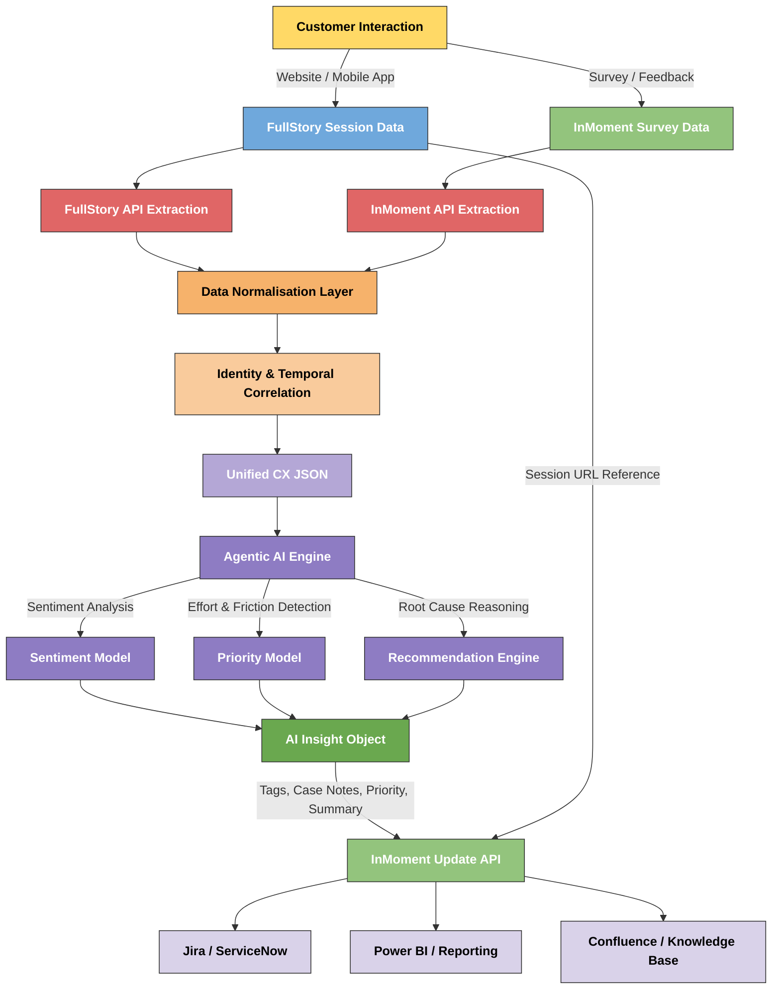

# Agentic AI Solution
Developing agentic AI solution for businesses to help with
* Sentiment Analysis/Intent Recognition
* Priority/Incident Determination
* Content Summarisation
* Recommendation
* Decision Escalation

Agentic Workflow is developed inside a full-code python environment which can be directly exported to cloud platforms like Azure [^1], AWS, GCloud for scalablity.

### synergy usecase

#### current capabilities

* **Agent Creator/Tester**: Create and Test Agents in Azure
* **data_creation_agent**: Generate real-world syntheic data for synergy (InMoment and Fullstory style)
* **Pseudo API call**: Mimic real-world api call to get data.
* **data_extraction**: Extract key-fields for processing
* **survey_intelligence_agent**: Generate AI summary, recommendation and sentiment 
* **data_enriching**: Enrich the original synthetic data with AI.

The simplar flowchart of our workflow:

[^1]: The current setup is developed for keeping **Azure** in mind, that can be changed later. For overview [click](https://ai.azure.com).
